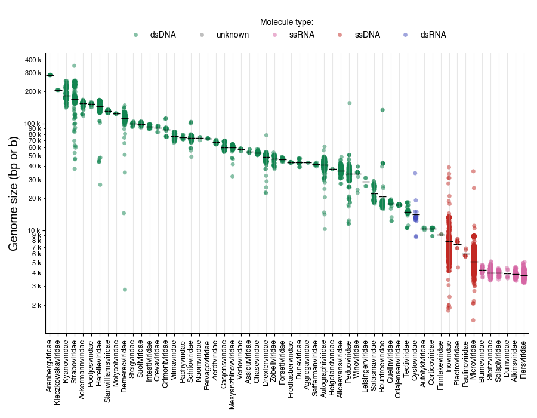

# Bacteriophage genome sizes

## Motivation
_What even is a "big" phage? Or a "small" one?_ I wanted a figure to discuss this very question in a talk, but I couldn’t find a plot I actually liked. The closest thing was [this](https://cdn.ncbi.nlm.nih.gov/pmc/blobs/41af/3820453/6e59e77cc92a/SCIENTIFICA2012-734023.002.jpg) figure from [Hyman and Abedon (2012)](https://pmc.ncbi.nlm.nih.gov/articles/PMC3820453/), which is helpful, but over a decade old, the y-axis labels are mysteriously missing (?), and more importantly, there’s been a major [taxonomic overhaul](https://pmc.ncbi.nlm.nih.gov/articles/PMC9868039/) since then. So, I figured it was time for a much-needed update.

## Notebooks
> The jupyter notebook that generates the main plot can be found [here](2025.ipynb).
> The previous version generating the updated 2012 plot can be found [here](2022.ipynb).

## Data
All the raw data can be found in [data/](data/). It was downloaded from NCBI Virus, selecting for complete nucleotide sequences.

## Contributions and usage
I did minimal data curation, so there are likely to be errors and odd outliers, but overall the numbers should be reasonable. If you spot any major issues in the code or visualization, please let me know! You can write an [issue](https://github.com/nataquinones/phage_genome_size/issues) or contribute with a [PR](https://github.com/nataquinones/phage_genome_size/pulls).

If you use these figures or code, please cite it like:
> Quinones-Olvera, N. Bacteriophage genome sizes https://github.com/nataquinones/phage_genome_size/
