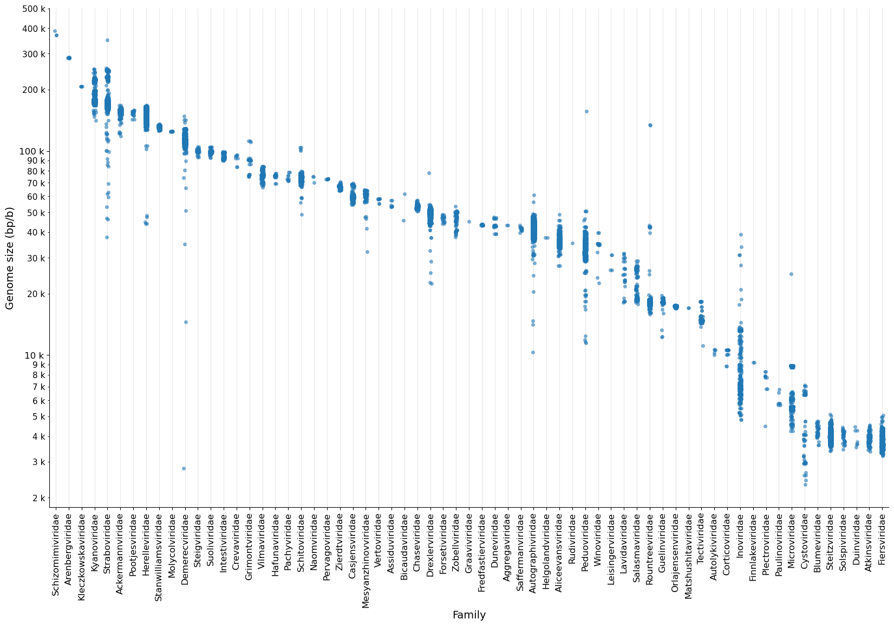

# Bacteriophage genome sizes

## Motivation
_What's a "big" phage? What's a "small" phage?_ I wanted a figure to discuss this in a talk, but I couldn't find a plot that I liked that showed the genome sizes of sequenced phages. The closest thing was [this](data/other/2012_Hyman.png) plot from [Hyman and Abedon (2012)](http://dx.doi.org/10.6064/2012/734023), but it's missing the y-axis labels (?). Although one can infer what those labels should be, I thought this nice little plot was due for a much needed update.

## Data
- NCBI Virus: Bacteriophages, Complete nucleotide sequences
    - Queried [here](https://www.ncbi.nlm.nih.gov/labs/virus/vssi/#/virus?VirusLineage_ss=Bacteriophage,%20all%20taxids&SeqType_s=Nucleotide&Completeness_s=complete)
    - Downloaded as a [table](data/20221102_ncbivirus.tsv) (2022-11-02)

## Results
> The jupyter notebook that generates these plots can be found [here](plots.ipynb).

### A new version of the 2012 plot

- Original plot [here](data/other/2012_Hyman.png)
- Download an interactive version of this plot [here](data/htmls/phage_sizes_selection.html)

### All families
- Download an interactive version of this plot [here](data/htmls/phage_sizes_all.html)

## Contributions and usage

There are clearly some weird outliers, I made the interactive versions of the plots (download [here](data/htmls/)) to make it easier to explore them. Any further curation of this dataset is highly appreciated! If you find something is off, please write [issue](https://github.com/nataquinones/phage_genome_size/issues) or contribute with a [PR](https://github.com/nataquinones/phage_genome_size/pulls).

If you use these figures or code, please cite it like:
> Quinones-Olvera, N. Bacteriophage genome sizes https://github.com/nataquinones/phage_genome_size/
